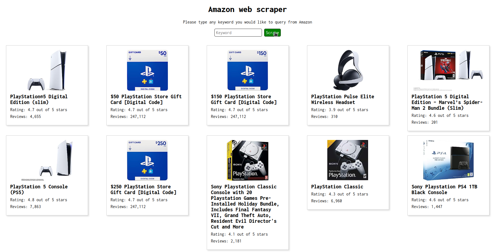

# Amazon web scraper

Web application to scrape Amazon search results from a given keyword.

## Requirements

- [Node.js](https://nodejs.org/) installed
- A web browser
- Free use of the port 3000 on your machine

## Setup and running

- Open the `server/` directory
- Run `npm install` to install all project dependencies
- Run `npm run start` to run the server in the port 3000
- Open the `client/` directory
- Open the `index.html` file in a web browser
